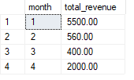
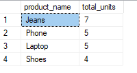

# OLTP & OLAP Integrated Retail Data Warehouse

## Overview
This project simulates a retail data pipeline that combines Online Transaction Processing (OLTP) and Online Analytical Processing (OLAP).

## Structure
- `/oltp_schema/`: Contains the transactional schema
- `/olap_schema/`: Contains the star schema
- `/etl_scripts/`: SQL for ETL operations
- `/sample_data/`: Placeholder for CSV files (optional)
- `/queries/`: SQL queries for business analytics

## Steps
1. Set up OLTP tables.
2. Populate sample transactional data.
3. Set up OLAP warehouse with a star schema.
4. Run ETL to populate fact_sales.
5. Execute analytical queries.

## Run-down on the work
- By the use of Microsoft SQL, we were able to create the OLTP database. Since Microsoft is different in place of SERIAL, we changed it to IDENTITY. This change help us in creating the table. See in `oltp.sql`
- Under the folder sample data, we excecuted the codes given and save it with the file name `sample_data.sql`. We used the data and filled the tables.
- For the OLAP database, we used the previous database from LAB 1 work.
- We ran the `elt.sql` and the results were successful.
- Using the queries given `analytical_queries`, we got the results of the monthly sales trend and top selling products.
 1. Monthly Sales Trends
 
 2. Top Selling Products
 
 
 - We did the reflection questions `REFLECTION QUESTIONS.rmd`

## Author & Contributors
- Mitchel Makena- 667413(@MMMakena)
- Esther Wambui - 669399(@Esther-Wambui)
- Kyra Joy Kariuki - 669619(@Kyrajwk)
- Queen Kibegi -668897(@QUEEN-KIBEGI)
- Claire Mwarari -669470(@dollykoi)
- Julie Koki- 669996(@juli3333)

# License
MIT License